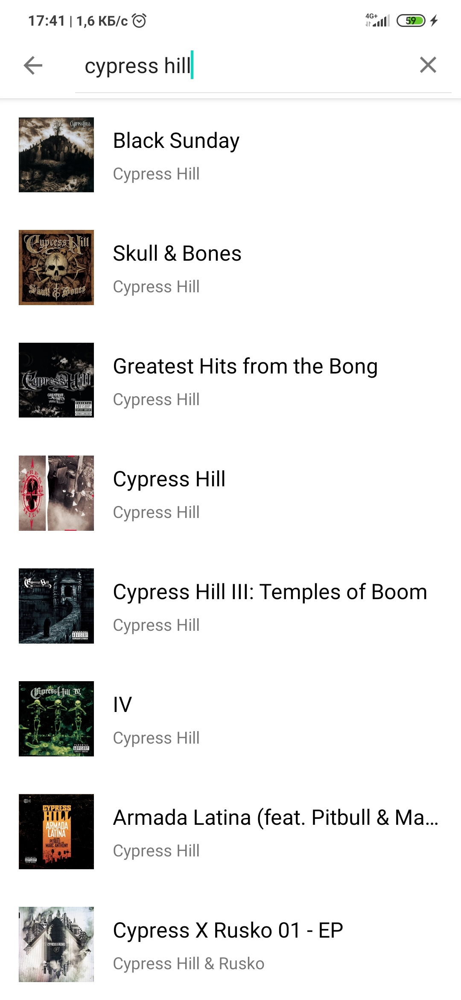
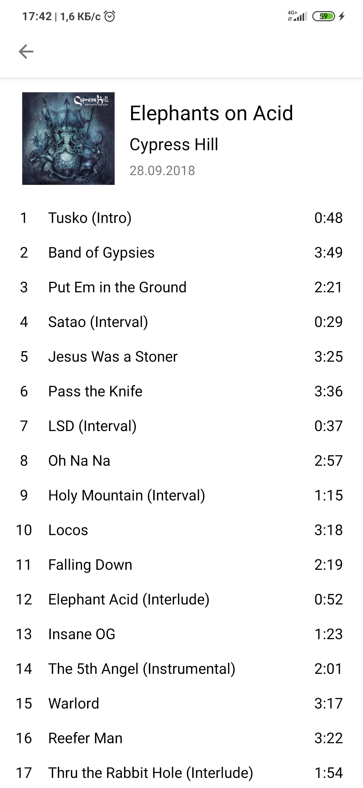
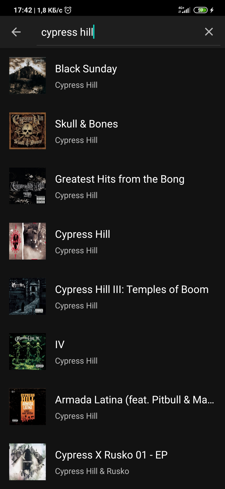
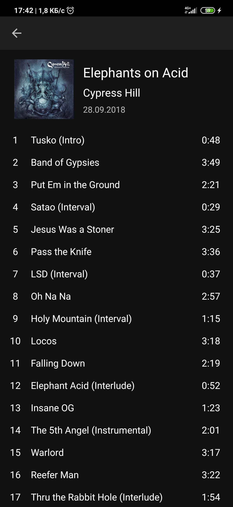

iTunesAlbums
==============

Test Android app that displays albums with detailed information from the iTunes API.

## Libraries

* [Toothpick](https://github.com/stephanenicolas/toothpick)

* [Moxy](https://github.com/moxy-community/Moxy)

* [Cicerone](https://github.com/terrakok/Cicerone)

* [RxJava 3](https://github.com/ReactiveX/RxJava)

* [RxAndroid](https://github.com/ReactiveX/RxAndroid)

* [Retrofit 2](https://github.com/square/retrofit)

* [Glide](https://github.com/bumptech/glide)

## Apk File

[iTunesAlbums.apk](https://drive.google.com/file/d/1d4E4OgodjHUoDx1OY9X0gKwSB4JvIE-8/)

## Screenshots

 

 
